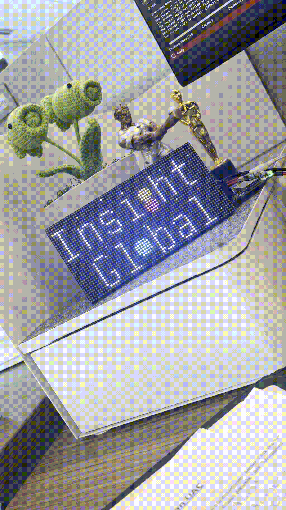

## animated LED Display setup

[Mu Editor](https://codewith.mu/en/download) — use for Python debugging.

[CircuitPython](https://circuitpython.org/board/adafruit_matrixportal_s3/) — download the `.uf2` file and drag it into the **`MATRXS3BOOT (E:)`** drive after resetting the wifi controller.

[CircuitPython Libraries](https://circuitpython.org/libraries/) — download the CircuitPython library bundle 

---

## (some) required CircuitPython Libraries

copy these files and folders from the CircuitPython library bundle into the **`lib`** folder in your MatrixPortal:

* `adafruit_matrixportal/`
* `adafruit_portalbase/`
* `adafruit_display_text/`
* `adafruit_bitmap_font/`
* `adafruit_bus_device/`

* `adafruit_debouncer.mpy`
* `adafruit_requests.mpy`
* `neopixel.mpy`

> use Mu Editor's Serial Console to view CircuitPython exceptions. if it says that another module/library is missing, just copy the corresponding library from the CircuitPython bundle into your `lib` folder.

## hardware components
* Adafruit 64×32 RGB LED Matrix – 2.5mm pitch (Display LED Panel).
* Adafruit MatrixPortal S3 (WiFi Controller)
* Adafruit 5V 4A Power Supply – SKU 890343 (Power Supply)
* Female 2.1mm DC jack → screw terminals (power supply ends in barrel plug, needed to connect to Display Panel)

  

